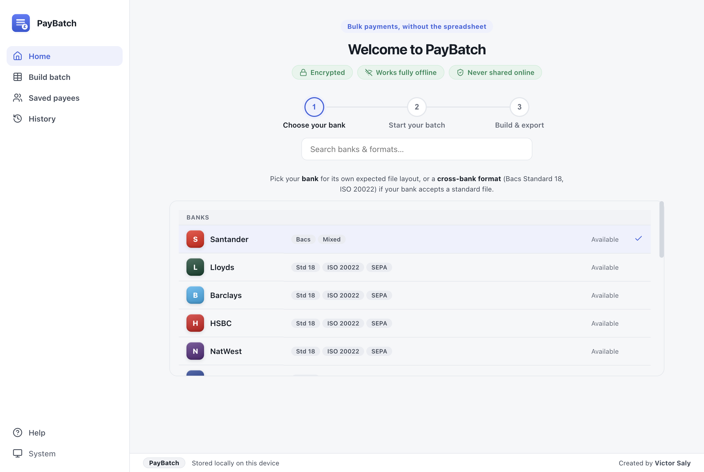
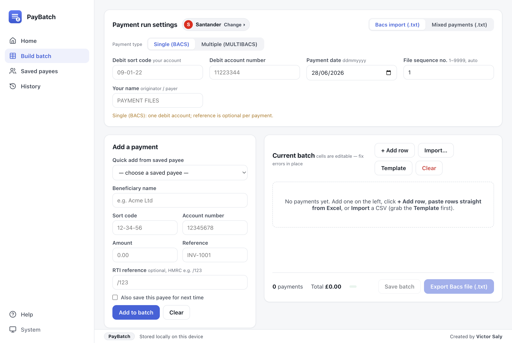
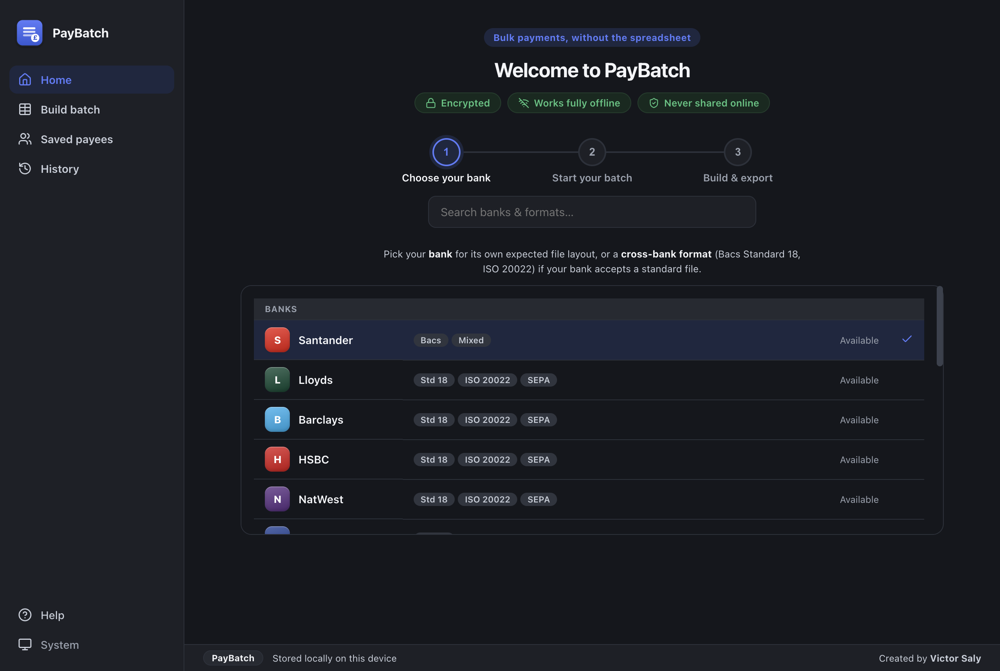
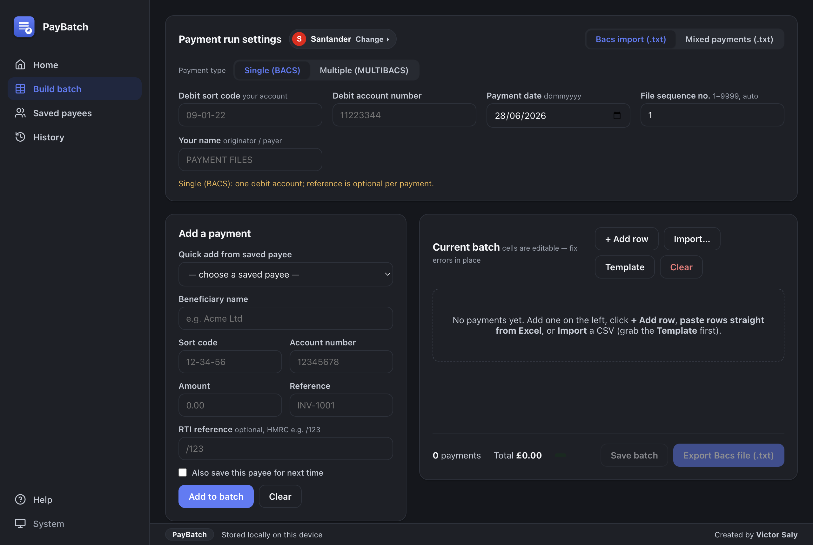

<div align="center">
  
  <h1>PayBatch</h1>
  <p><strong>A local, offline desktop app that builds and exports your bank's
  bulk-payment import files — replacing the clunky Excel process.</strong></p>
  <p><em>Santander, HSBC, Barclays, Lloyds, NatWest &amp; more — via Bacs Standard 18, ISO 20022 (UK) and SEPA (EUR).</em></p>

  <p>
    <a href="https://victorsaly.github.io/batch-payment-app/"><strong>🌐 Website</strong></a> ·
    <a href="https://github.com/victorsaly/batch-payment-app/releases/latest"><strong>⬇️ Download</strong></a> ·
    <a href="CHANGELOG.md"><strong>Changelog</strong></a> ·
    <a href="ROADMAP.md"><strong>Roadmap</strong></a> ·
    <a href="FORMATS.md"><strong>Bank formats</strong></a>
  </p>

  <p>
    <a href="https://github.com/victorsaly/batch-payment-app/actions/workflows/ci.yml">
      
    </a>
    
    
    
  </p>
</div>

---

Enter payments (or import/paste from Excel), fix any problems with **inline validation**
(including a real **UK modulus check**), and export the exact file your bank expects —
Bacs, ISO 20022 or SEPA. Everything runs on your own machine — **no data ever leaves
your computer**, and what's stored is **encrypted**.

## Screenshots

| Choose your bank — guided wizard | Build batch |
| --- | --- |
|  |  |

| Home — dark mode | Build batch — dark mode |
| --- | --- |
|  |  |

## Features

- ✅ **Multiple banks & formats** — Santander (Bacs import + mixed payments), plus the
  cross-bank standards **Bacs Standard 18**, **ISO 20022** (UK domestic GBP) and **SEPA**
  (euro/IBAN). Pick your bank and the right format is offered. *(Verify with a test
  upload — formats are built from public specs.)*
- ✅ **Guided wizard** — a step-by-step start (Choose your bank → Start your batch →
  Build & export) with a searchable bank/format list that separates **banks** from
  **cross-bank formats** and shows each option's supported formats.
- ✅ **Light & dark themes** — System / Light / Dark, remembered between launches.
- ✅ **UK modulus check** — the official VocaLink check flags sort code/account
  combinations that can't be real accounts (likely typos), as an amber warning.
- ✅ **Inline, per-field validation** — bad cells are highlighted with the reason; the
  Export button stays disabled until everything is clean.
- ✅ **Editable grid + paste from Excel** — type straight into the table, paste rows from
  a spreadsheet, use the quick-add form, or import a CSV (columns auto-detected).
- ✅ **Saved payees & batch history** — reuse beneficiaries and reload past runs.
- ✅ **Encrypted local storage** — payees, batches and settings are encrypted with your
  OS keychain (`safeStorage`). Fully offline.
- ✅ **Auto-opens the generated file** so you can eyeball it before uploading.

## Download & install

Grab the latest installer for your OS from the
[**Releases**](https://github.com/victorsaly/batch-payment-app/releases) page:

| OS | File |
|----|------|
| macOS | `PayBatch-x.y.z.dmg` |
| Windows | `PayBatch-Setup-x.y.z.exe` |
| Linux | `PayBatch-x.y.z.AppImage` / `.deb` |

> **macOS** — the app is signed with an Apple Developer ID and notarized by Apple,
> so it opens with a normal double-click (no Terminal step needed).
>
> **Windows** — the installer isn't code-signed yet, so SmartScreen may appear;
> click **More info → Run anyway**.

## Run from source

```bash
git clone https://github.com/victorsaly/batch-payment-app.git
cd batch-payment-app
npm install
npm start            # Vite dev server + Electron, with hot reload
```

Requires Node.js 18+. The UI is **React + Vite**; the payment-format engines are pure,
dependency-free modules reused by the renderer via `src/renderer-src/core.js`.

## Build installers locally

```bash
npm run dist:mac     # macOS .dmg + .zip
npm run dist:win     # Windows NSIS installer
npm run dist:linux   # Linux AppImage + .deb
```

Output lands in `dist/`.

## Releasing new versions (CI)

Pushing a version tag triggers [`.github/workflows/release.yml`](.github/workflows/release.yml),
which builds on macOS, Windows and Linux runners and uploads the installers to a
GitHub Release (created as a **draft** for you to review and publish):

```bash
# bump "version" in package.json first, then:
git tag v1.0.0
git push origin v1.0.0
```

No secrets to configure — it uses the built-in `GITHUB_TOKEN`.

## File formats

Pick your **bank**, then the **Output format** offered for it. PayBatch can generate:

- **Santander Connect** — Bacs payment import + mixed payments (below)
- **Bacs Standard 18** — the cross-bank fixed-width credit file
- **ISO 20022** — `pain.001.001.09` UK domestic GBP (sort code + account)
- **SEPA** — `pain.001.001.03` euro credit transfers (IBAN/BIC, BIC optional)

The full bank-by-bank matrix is in **[FORMATS.md](FORMATS.md)**. The Santander formats:

### Bacs import (Santander Connect spec)

Comma-separated `.txt`, three record types:

```
PAYMENT,HEADER,<creationDate ddmmyyyy>,<fileLocationId>,<sequenceNo>
PAYMENT,<BACS|MULTIBACS>,<debit 6n+8n>,<name 35>,<sort 6n>,<account 8n>,<amount>,<paymentDate ddmmyyyy>,<reference 18>,<rti>
PAYMENT,TRAILER,<hashTotal 15n in pence>,<recordCount>
```

`BACS` = single payments; `MULTIBACS` = multiple payments sharing one debit account
and date (reference becomes mandatory). Free-text fields are uppercased and limited to
`A–Z 0–9 . - / & space`; the hash total is the value in pence, zero-padded to 15.

### Mixed payments (wide 85-column layout)

Headerless, one row per payment, LF line endings, mixed-case preserved. Reverse-engineered
byte-for-byte from a real sample. Only a payment date and the beneficiary rows are needed.

> ⚠️ The mixed format has no published spec — it's matched against a sample. **Always do
> one small test upload** in Santander Connect before relying on either format.

The complete layout for both formats lives in one file:
[`src/santander.js`](src/santander.js) (`SPEC` and `MIXED` blocks).

## Validation rules

| Field | Rule |
|------|------|
| Beneficiary name | Required. Bacs: uppercased, max 35 (first 18 reach Bacs). Allowed: `A–Z 0–9 . - / & space`. |
| Sort code | Exactly 6 digits (dashes/spaces ignored). |
| Account number | Exactly 8 digits. |
| Amount | Greater than 0, pounds & pence (e.g. `150.50`). |
| Reference | Max 18 chars. Mandatory for MULTIBACS; optional otherwise. |
| RTI reference | Bacs only, optional. Starts with `/`, e.g. `/123`. |

## Data & security

- All data is stored only on your computer, encrypted via the OS keychain
  (Keychain on macOS, DPAPI on Windows) using Electron `safeStorage`.
- The app makes **no network requests** (enforced with a strict Content-Security-Policy).
- An older plaintext data file is migrated to the encrypted store on launch.
- The renderer has no Node/filesystem access — it talks to disk only through a small,
  explicit IPC bridge ([`preload.js`](preload.js)).

## Project layout

| File | Purpose |
|------|---------|
| `main.js` | Electron main process — window, encrypted storage, import/export dialogs |
| `preload.js` | Secure IPC bridge between UI and filesystem |
| `src/santander.js` · `standard18.js` · `iso20022.js` · `sepa.js` · `modulus.js` | **Pure format engines + validation** |
| `src/banks.js` | Bank / cross-bank-format registry |
| `src/renderer-src/` | React + Vite UI (screens, components, store); reuses the engines via `core.js` |
| `src/styles.css` | Design-token stylesheet (light + dark) |
| `test/run.js` | Dependency-free test suite (`npm test`) |
| `.github/workflows/` | CI + release pipelines |

## Testing

```bash
npm test
```

Covers byte-exact reproduction of both formats, validation rules, and CSV import.

## Disclaimer

This is an independent tool, **not affiliated with, endorsed by, or supported by
Santander**. Provided "as is" without warranty (see [LICENSE](LICENSE)). You are
responsible for verifying every payment detail and reconciling totals before
submitting a file to your bank.

## License

[MIT](LICENSE) © 2026 Victor Saly
